# EDP-IO: Enterprise Data Platform with Intelligent Observability

<div align="center">


**A mock production-ready enterprise data platform demonstrating modern data engineering patterns, intelligent observability, and DataOps best practices.**

[Architecture](#architecture) • [Quick Start](#quick-start) • [Modules](#modules) • [LLM Integration](#llm-observability) • [DataOps](#dataops)

</div>

---

## 🎯 Executive Summary

EDP-IO is a comprehensive data platform that ingests retail data from Oracle ERP and SQL Server e-commerce systems, transforms it through a Lakehouse architecture (Bronze → Silver → Gold), and provides intelligent observability using LLM-powered analysis.

### Key Differentiators

| Feature | Implementation |
|---------|---------------|
| **Mock Production-Ready** | Production interfaces with development mocks—deploy with credentials only |
| **LLM as Advisor Only** | AI never executes; only suggests with human approval required |
| **Enterprise Security** | Secret management, PII masking, RBAC patterns |
| **Full DataOps** | IaC with Terraform, CI/CD with GitHub Actions, testing with pytest |

---

## 🏗️ Architecture

### System Overview


### Lakehouse Data Flow

```mermaid
flowchart LR
    subgraph Bronze["🥉 Bronze"]
        B1[customers]
        B2[products]
        B3[orders]
        B4[order_items]
    end
    
    subgraph Silver["🥈 Silver - SCD2"]
        S1[stg_customers]
        S2[stg_products]
        S3[stg_orders]
    end
    
    subgraph Gold["🥇 Gold - Star Schema"]
        D1[dim_customer]
        D2[dim_product]
        D3[dim_date]
        F1[fact_sales]
    end
    
    B1 --> S1 --> D1
    B2 --> S2 --> D2
    B3 & B4 --> S3
    D1 & D2 & D3 & S3 --> F1
```



### Star Schema ERD


### RAG Pipeline


### Airflow Orchestration DAG

```mermaid
flowchart TB
    START((Start)) --> ING
    
    subgraph ING["📥 Ingestion - Parallel"]
        I1[Oracle: customers]
        I2[Oracle: products]
        I3[SQL: orders]
    end
    
    ING --> DBT_S[dbt Silver]
    DBT_S --> DBT_G[dbt Gold]
    DBT_G --> DBT_T[dbt Test]
    DBT_T --> OBS[Generate Docs]
    OBS --> END((End))
```



### LLM Observability Flow

```mermaid
flowchart LR
    subgraph Calls
        A[Log Analyzer]
        B[Schema Drift]
        C[Doc Generator]
        D[Chatbot]
    end
    
    subgraph Track["📊 Tracker"]
        T[Tokens + Cost + Latency + Confidence]
    end
    
    subgraph Store
        DB[(Metrics Store)]
    end
    
    subgraph Viz["📈 Dashboard"]
        V[LLM Observability Page]
    end
    
    A & B & C & D --> T --> DB --> V
```



### CI/CD Pipeline


---

### Technology Stack

| Layer | Technology | Multi-Cloud Alternatives |
|-------|------------|-------------------------|
| **Orchestration** | Apache Airflow | Databricks Workflows, ADF |
| **Ingestion** | PySpark, Delta Lake | Portable across clouds |
| **Transformation** | dbt-core | Portable (dbt-databricks, dbt-bigquery) |
| **Storage** | Azure ADLS | GCP GCS, AWS S3 (via `StorageProvider`) |
| **Compute** | Databricks | GCP Dataproc, AWS EMR (via `ComputeProvider`) |
| **LLM** | Azure OpenAI | Vertex AI, Bedrock (via `LLMProvider`) |
| **Serverless** | Azure Functions | Cloud Run, Lambda (via `ServerlessProvider`) |
| **IaC** | Terraform | Multi-cloud modules included |

### Multi-Cloud Provider Abstractions

```python
from src.providers import get_storage_provider, get_llm_provider

# Automatically uses configured provider (CLOUD_PROVIDER env var)
storage = get_storage_provider()  # Azure ADLS / GCS / S3
storage.upload_file("data.parquet", "bronze/customers/")

llm = get_llm_provider()  # Azure OpenAI / Vertex AI / Bedrock
response = llm.chat([{"role": "user", "content": "Analyze this error"}])
```

---

## 🚀 Quick Start

### Prerequisites

- Python 3.11+
- Git

### Installation

```bash
# Clone repository
git clone https://github.com/enterprise/edp-io.git
cd edp-io

# Create virtual environment
python -m venv venv
source venv/bin/activate  # Windows: venv\Scripts\activate

# Install dependencies
pip install -r requirements.txt

# Copy environment configuration
cp .env.example .env
```

### Run Dashboard (Mock Mode)

```bash
# Start Streamlit dashboard
streamlit run app/main.py
```

Visit `http://localhost:8501` to see the executive dashboard.

### Run Tests

```bash
# Run all tests
pytest tests/ -v

# With coverage
pytest tests/ --cov=src --cov-report=html
```

---

## 📦 Project Structure

```
EDP-IO/
├── src/
│   ├── ingestion/              # Bronze layer ingestion
│   │   ├── bronze_writer.py    # Delta Lake writer with MERGE
│   │   ├── oracle_ingest.py    # Oracle ERP ingestion
│   │   ├── sqlserver_ingest.py # SQL Server ingestion
│   │   ├── mock_data.py        # Retail mock data generator
│   │   └── data_contracts/     # Schema definitions
│   │
│   ├── observability/          # LLM-powered observability
│   │   ├── log_analyzer.py     # Error analysis with suggestions
│   │   ├── schema_drift.py     # Schema change detection
│   │   ├── doc_generator.py    # Auto-documentation
│   │   ├── rag_context.py      # Chained RAG for context retrieval
│   │   └── llm_metrics.py      # Usage/cost/quality tracking
│   │
│   ├── orchestrator/           # Pipeline orchestration
│   │   └── dag_daily.py        # Airflow DAG
│   │
│   └── utils/                  # Core utilities
│       ├── config.py           # Settings with feature flags
│       ├── security.py         # SecretProvider, PIIMasker
│       └── logging.py          # Structured logging
│
├── dbt_project/                # dbt transformations
│   ├── models/
│   │   ├── silver/             # SCD Type 2 models
│   │   └── gold/               # Star schema (dims & facts)
│   └── macros/                 # SCD2 macro
│
├── app/                        # Streamlit interface
│   ├── main.py                 # Executive dashboard
│   └── pages/                  # Pipeline, Quality, Lineage, Chatbot, LLM Analytics
│
├── infra/terraform/            # Infrastructure as Code
│   ├── main.tf                 # Azure resources
│   └── environments/           # Dev/Prod configs
│
├── .github/workflows/          # CI/CD pipelines
│   ├── ci.yml                  # Lint, test, deploy
│   └── dbt-daily.yml           # Scheduled dbt runs
│
└── tests/                      # pytest test suite
```

---

## 🧩 Modules

### Module A: Ingestion & Bronze Layer

**Purpose:** Ingest data from source systems with enterprise patterns.

**Key Features:**
- **Data Contracts:** YAML-defined schemas with quality rules
- **Idempotent Writes:** MERGE operations prevent duplicates
- **Mock Fallback:** `RetailMockDataGenerator` for development
- **Metadata Tracking:** `_ingestion_timestamp`, `_batch_id`, `_source_system`

```python
# Example: Bronze ingestion
from src.ingestion import BronzeWriter, WriteMode

writer = BronzeWriter(spark, bronze_path="/data/bronze")
writer.write(
    df=customers_df,
    table_name="customers",
    source_system="oracle_erp",
    business_keys=["customer_id"],
    mode=WriteMode.MERGE,
)
```

### Module B: dbt Transformation

**Purpose:** Transform Bronze to Silver (SCD2) and Gold (Star Schema).

**Silver Layer (SCD Type 2):**
- `stg_customers` - Customer history with valid_from/valid_to
- `stg_products` - Price history tracking
- `stg_orders` - Validated transactions

**Gold Layer (Star Schema):**
- `dim_customer` - Customer dimension with segments
- `dim_product` - Product dimension with categories
- `dim_date` - Calendar dimension
- `fact_sales` - Order line grain with revenue/profit

### Module C: LLM Observability

**Purpose:** Intelligent observability with LLM as *advisor only*.

**Key Principle:** LLM never executes—only suggests with `requires_human_approval: true`.

```python
from src.observability import LogAnalyzer

analyzer = LogAnalyzer()
result = analyzer.analyze("Schema error: column 'loyalty_points' not found")

print(result.root_cause)          # "New column added without contract update"
print(result.recommended_action)  # "1. Review new column\n2. Update contract..."
print(result.requires_human_approval)  # Always True
```

**Components:**
| Component | Purpose |
|-----------|---------|
| `LogAnalyzer` | Analyze errors, suggest fixes |
| `SchemaDriftDetector` | Detect and assess schema changes |
| `DocGenerator` | Auto-generate documentation from dbt |
| `RAGContextProvider` | Retrieve context for grounded LLM responses |

**Chained RAG Architecture:**
```
Query → [Classify] → [Retrieve Context] → [Rank] → [LLM + Context] → Response
              ↓              ↓
        QueryType      Data Contracts
                       dbt Manifest
                       Error History
```

### Module D: Streamlit Interface

**Purpose:** Executive-friendly dashboard for platform monitoring.

**Pages:**
1. **Home** - KPIs, pipeline health, alerts
2. **Pipeline Status** - Execution history, errors
3. **Data Quality** - Quality scores by layer, trends
4. **Data Lineage** - Visual flow with Mermaid diagrams
5. **Ask the Architect** - LLM-powered Q&A chatbot
6. **LLM Observability** - Token usage, costs, quality by role

---

## 🔒 Security

### Feature Flags

Control mock vs. production behavior via environment variables:

| Flag | Default | Purpose |
|------|---------|---------|
| `ENABLE_LLM_OBSERVABILITY` | `false` | Enable Azure OpenAI integration |
| `ENABLE_REAL_DATABASE_CONNECTIONS` | `false` | Connect to real Oracle/SQL Server |
| `ENABLE_AZURE_INTEGRATION` | `false` | Use Azure Key Vault for secrets |

### Secret Management

```python
from src.utils.security import SecretProvider

# Automatically uses MockSecretProvider in dev, AzureKeyVault in prod
password = SecretProvider.get("ORACLE_PASSWORD")
```

### PII Masking

```python
from src.utils.security import PIIMasker

# Masks emails, phones, CPF, credit cards
masked = PIIMasker.mask("Email: john@email.com, CPF: 123.456.789-00")
# Output: "Email: j***@e***.com, CPF: ***.***.789-00"
```

---

## ⚙️ DataOps

### Infrastructure as Code (Terraform)

```bash
cd infra/terraform

# Initialize
terraform init

# Plan for dev
terraform plan -var-file="environments/dev.tfvars"

# Apply
terraform apply -var-file="environments/dev.tfvars"
```

**Resources Created:**
- Azure Resource Group
- ADLS Gen2 Storage (Bronze/Silver/Gold containers)
- Azure Key Vault
- Databricks Workspace

### CI/CD (GitHub Actions)

**ci.yml** runs on every push:
1. **Lint:** Black, Flake8, mypy
2. **Test:** pytest with coverage
3. **dbt:** Parse and compile validation
4. **Security:** Bandit, Safety scans
5. **Terraform:** Format and validate
6. **Deploy:** Staging (main) → Prod (release/*)

**dbt-daily.yml** runs scheduled:
- Daily at 06:00 UTC
- Sequential: Silver → Gold layers
- Generates artifacts for lineage

---

## 📊 Interview Guide

### Key Talking Points

1. **Why Lakehouse over traditional DW?**
   - ACID transactions with Delta Lake
   - Schema evolution support
   - Time travel for debugging
   - Cost-effective storage

2. **Why SCD Type 2?**
   - Full history preservation
   - Point-in-time analysis
   - Compliance requirements
   - Trade-off: Storage vs. query complexity

3. **Why LLM as Advisor Only?**
   - Deterministic pipelines (no LLM in ETL)
   - Human-in-the-loop safety
   - Reduces MTTR without risk
   - Gradual trust building

4. **How to make this production-ready?**
   - Add real credentials to Key Vault
   - Remove feature flag overrides
   - Configure production Terraform vars
   - Enable Azure integration flags

### Design Trade-offs

| Decision | Trade-off | Rationale |
|----------|-----------|-----------|
| Delta Lake | Lock-in to Delta | ACID + time travel worth it |
| SCD2 everywhere | Storage cost | Historical analysis critical |
| Mock-first | Initial setup | Enables CI/CD without credentials |
| Incremental models | Complexity | Performance at scale |

---

## 🔮 Roadmap

- [ ] Real-time ingestion with Kafka
- [ ] ML feature store integration
- [ ] Power BI semantic layer
- [ ] Multi-cloud (GCP Dataproc)
- [ ] Advanced LLM agents (with guardrails)

---

## 📄 License

This project is for demonstration purposes. See [LICENSE](LICENSE) for details.

---

<div align="center">

**Built with ❤️ for Data Engineering Excellence**

[⬆ Back to Top](#edp-io-enterprise-data-platform-with-intelligent-observability)

</div>
